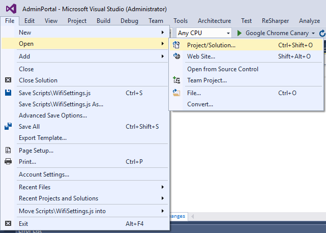
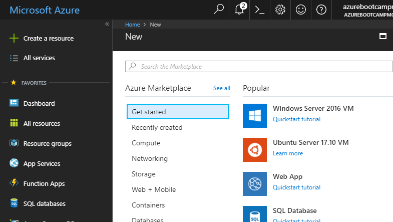
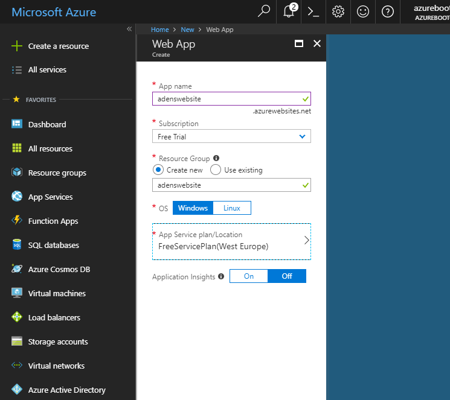
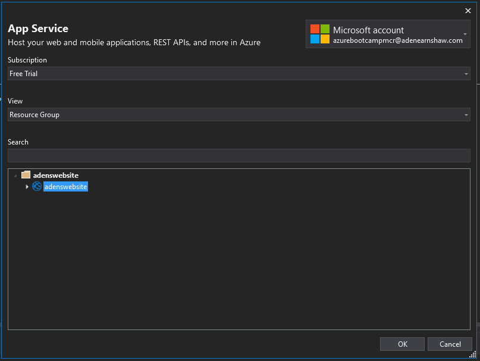
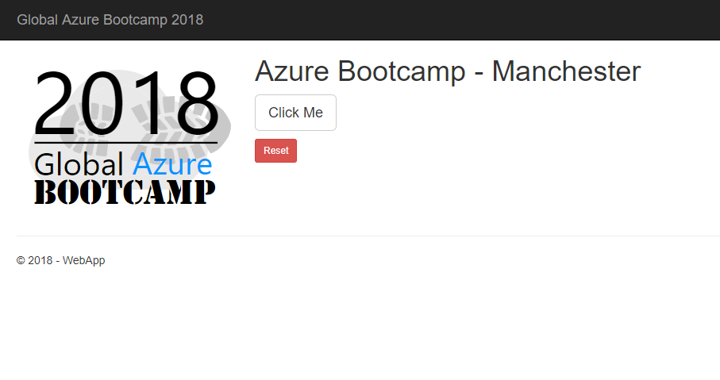
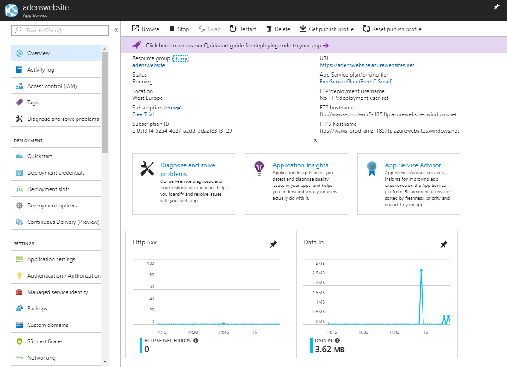
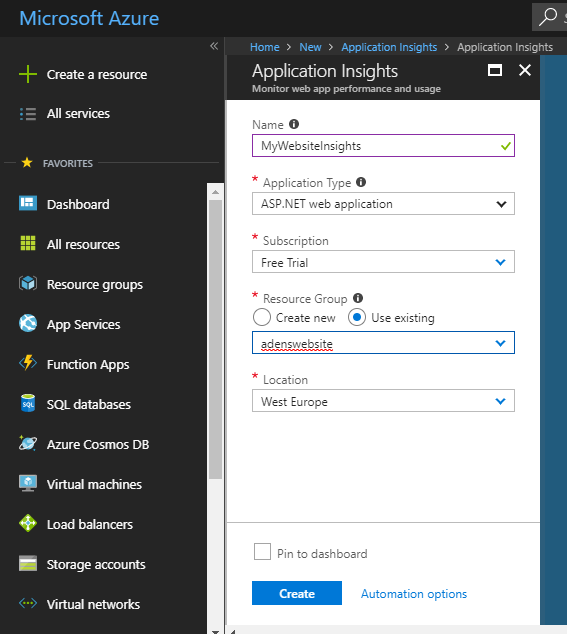
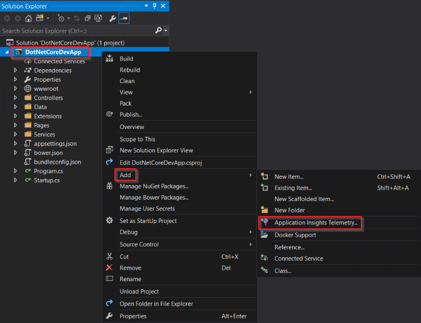
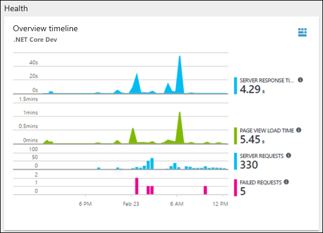

# WebApps - Hands On Lab 1

## Goal

By the end of this HOL you should be able to build and deploy an ASP.NET Core Website to Azure using the integrated Build and Relase features of VSTS

## Steps

### Step 1 - Load the solution

Fire up Visual Studio. Click `File -> Open -> Project/Solution` and open the basic sample Solution found in the *Start* folder of this HOL.  



### Step 2 - Run the website

Build and run the solution on your machine, to verify everything works. You should see a simple single page application with two buttons on it.

### Step 3 - Create your WebApp Resource

Log into the [Azure Portal](https://portal.azure.com), click on the "Create a resource" button in the side bar, then select "Web App"



A new blade will open and ask you to enter details of your new web app. Enter a unique App name, then select your subscription and choose to create a new Resource Group.  

Don't use the default Service plan, click on this and change it to Free plan. You can change this later if you want to explore the additional benefits of the paid packages.



Click the Done button at the bottom of the blade, and your Web App will be created within a minute or two.

You'll receive a notification in the portal once the app has been created, and you can move to the next step.

### Step 4 - Publish your website

Go back to the instance of visual Studio where your app is open. Right click the `WebApp` project and click "Publish".

A dialog will appear asking you where you'd like to deploy to, select Azure and continue to the next page.

From here you'll be able to select the Web App you've just created. Click `OK` and Visual Studio will automatically start the process of pushing your website to Azure.



n.b. If your Subscription doesn't immediately appear, you may need to add your account, using the drop down in the top right of the dialog.

Once your app publishes successfully, a browser tab should open and display your newly deployed website.



Hit `F5` a couple of times then switch back to the Azure Portal. In the page dedicated to your WebApp, you'll be able to see some basic performance metrics.



### Step 5 - Create new AppInsights resource

Now we're going to add some additional Analytics to your website using Application Insights.

Let's go back to the Portal and create a New Resource. If you can't find Application Insights in the New Resource list immediately, use the search bar at the top and it should find it.

You will be asked to fill in details of your new Application Insights service, complete the details as appropriate. I would recommend selecting your existing *Resource Group* so that you can organise all your WebApp associated resources together.



### Step 6 - Add Application Insights to website

We're going to add Application Insights into two places. We're going to add the base package so we can get customer metrics, and we're also going to implement on the client too, so that we can see how many times people clicked the button before leaving the page.

1. Open your ASP.NET Core Web App **project** in Visual Studio > Right-click on the AppName in the **Solution Explorer** > Select **Add** > **Application Insights Telemetry**.



2. Click the **Start Free** button > Select the **Existing resource** you created in the Azure portal > Click **Register**.

3. Open **_Layout.cshtml** and check that `@Html.Raw(JavaScriptSnippet.FullScript)` has been added to the bottom of the `Head` node. This allows you to use App Insights from within your JavaScript code.

4. Open Site.js and add the following code to the bottom of the `onInit()` function:

```javascript
window.addEventListener("beforeunload", function (event) {
    appInsights.trackMetric("User left", clickCount);
});
```

5. Then add the following code to the bottom of the `clearCount()` function:

```javascript
appInsights.trackEvent("User reset Count");
```

Now we've added some code to track a user's activity, it's time to re-publish the website, do some clicking and then go see your results.

### Step 7 - Check out the portal 

From the App Insight's page in the Portal, you'll be given a healthy supply of data, letting you know key metrics.



To find our data, navigate to the **Metrics Explorer** from the **Investigate** section. 

From here you can add custom charts to expose the events and metrics being sent by the website.

1. Click **Add chart**, then select a **Line** chart. From the **Metrics** section, select **Custom** and **User Left** should appear.

Once done you should be able to see your websites custom metrics coming through.

n.b. there is usually a slight delay of about 90 seconds between data being sent from the website and being displayed in Application Insights, so don't worry if it doesn't show up right away.

## End


